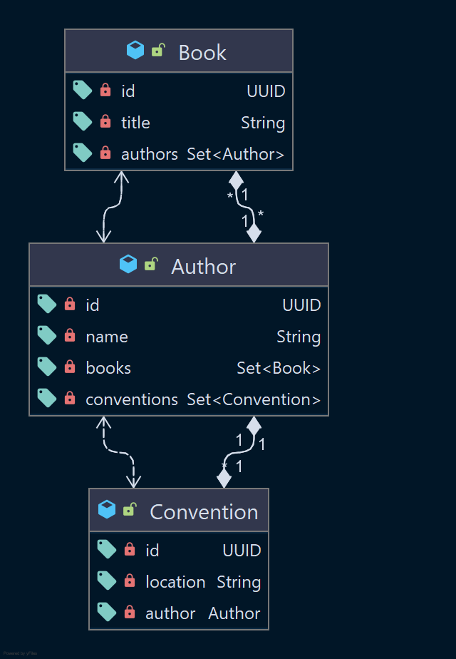

# Demo de criteria query

El proposito de este demo es para ver los problemas de consultas cuando en un requisito nos piden: "Deseamos que se pueda consultar X cosa cuando le paso Y palabra..."

Estos requisitos generalmente son un 🥊 K.O a nuestras consultas en SQL, más cuando estás cargan con alguna relación o peor varias relaciones que tienen a su vez entidades con otras relaciones; es aquí donde se empieza a generar malestar hacia el módelo de datos si este no está bien definido y la normalización no es la adecuada.

🏴 Para entender ⚠️

- [x] Un módelo denormalizado facilita las consultas y mejora el performance dependiendo de su producto cartesiano en las consultas.
- [x] Un módelo denormalizado no garantiza flexibilidad cuando una aplicación crece.
- [x] Un módelo denormalizado se parece a la interpretación que se de en un ORM, pero JAMÁS ES IGUAL.
- [x] Un módelo normalizado garantiza consistencia, sin embargo se obtiene complejidad
- [x] Un módelo normalizado facilita la eliminación y/o modificación de tuplas, salvando condicionales en las consultas
- [x] Un módelo normalizado puede o no facilitar consultas y puede o no mejorar el performance según la misma.

El caso ejemplo que se visualiza acá es de un escritor y sus convenciones donde ha realizado sus escritos:
Un autor puede tener varios libros y varios libros pueden ser de multiples autores A una convención pueden ir varios
autores y un autor puede participar en una a la vez, pero pudo haber participado en varias

Este es el modelo ORM que presenta Java, no tocaré SQL en este demo, solo la ejecución que interpreta el proveedor de
persistencia:

